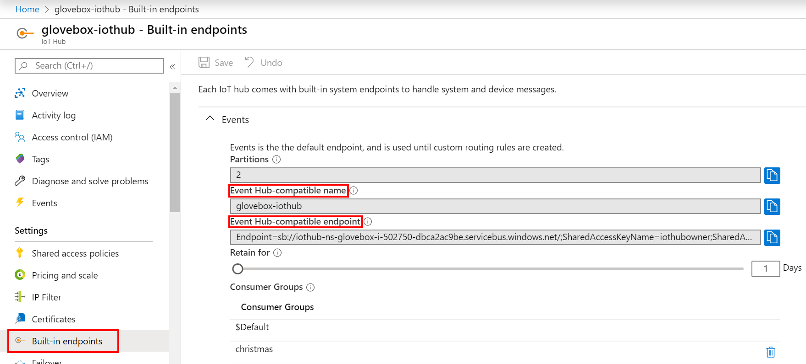
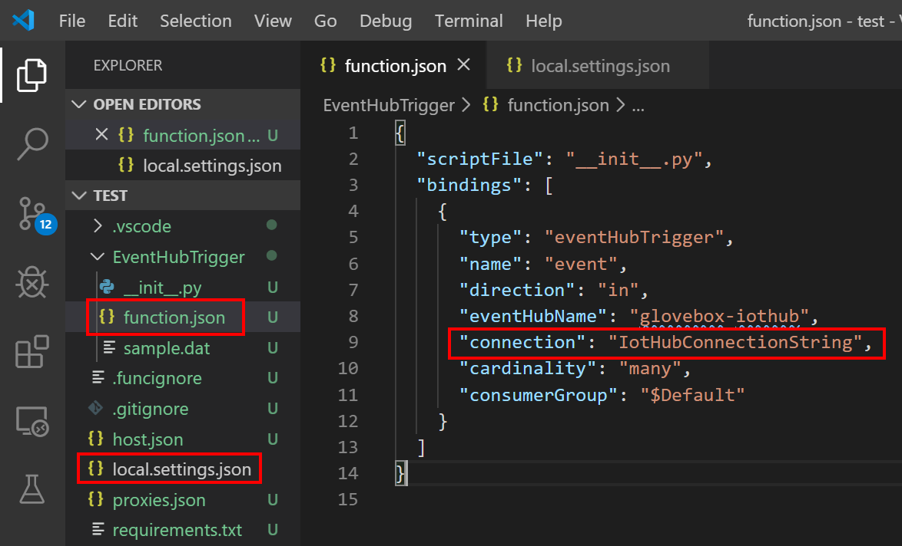
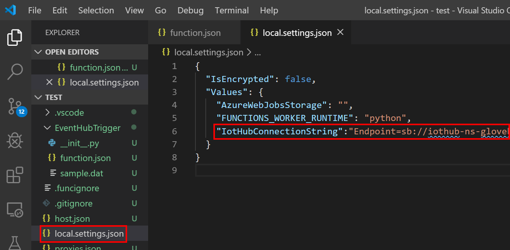
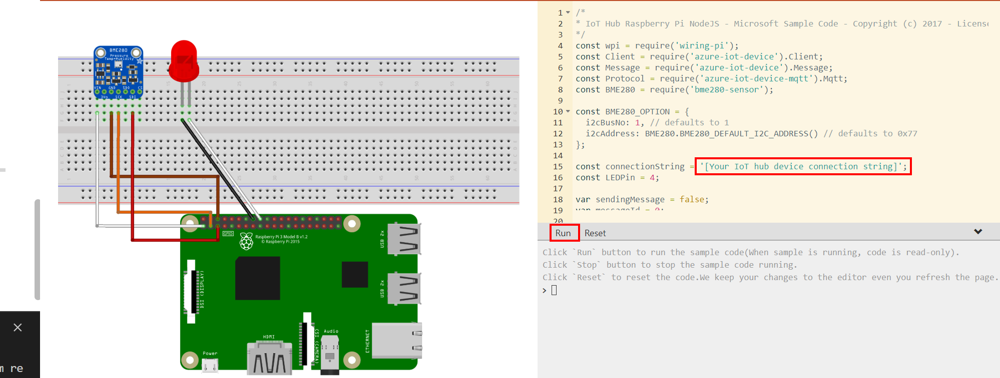
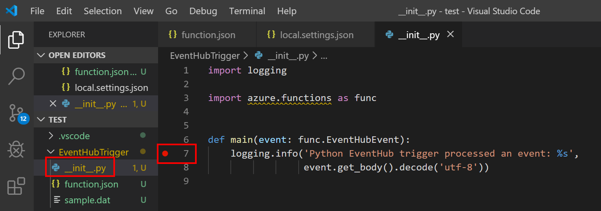
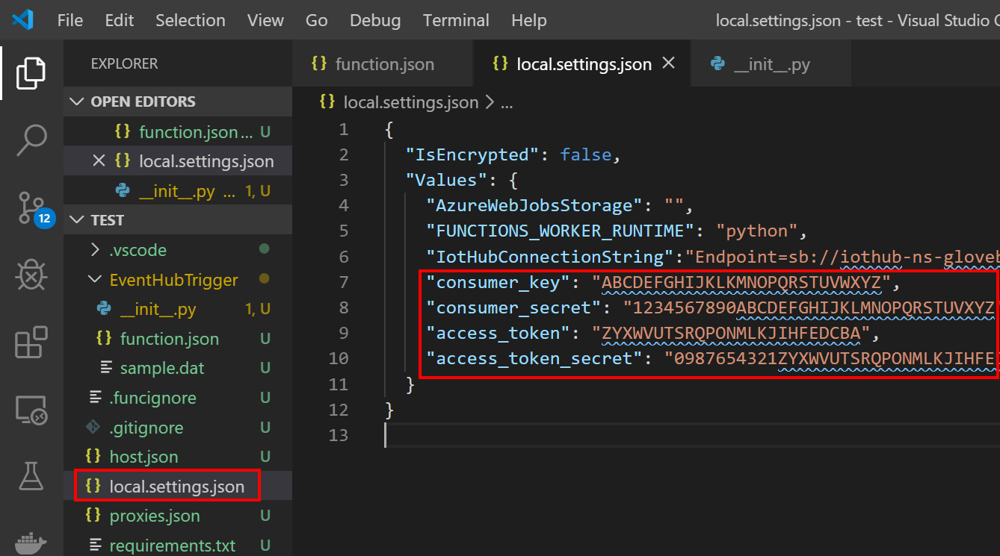

# Skippy, Kenny, and Willy need our help - Day 17 of the #25DaysOfServerless Challenge

---

This article is part of [#25DaysOfServerless](https://25daysofserverless.com/). New challenges will be published every day from Microsoft Cloud Advocates throughout the month of December. Find out more about how Microsoft Azure enables your [Serverless functions](https://docs.microsoft.com/azure/azure-functions/?WT.mc_id=25days_devto-blog-cxa).

Have an idea or a solution? [Share your thoughts on Twitter!](https://twitter.com/intent/tweet?text=I%27m%20joining%20the%20@azureadvocates%20%2325DaysOfServerless%20challenge!!%20Learn%20more%20at%20https://aka.ms/25daysofserverless%20or%20see%20solutions%20at%20https://dev.to/search?q=25DaysOfServerless!%20Join%20me!)

---

Time for an Australian Christmas day BBQ on the beach.

Skippy the Kangaroo, and his mates, Kenny the Koala, and Willy the Wombat were very excited and looking forward to Christmas. ‘Only one more sleep’ said Kenny the Koala, ‘I have been very good all year’. Skippy and Willy looked at each other and rolled their eyes, ‘you have not been that good’ they thought. Skippy reminded his mates, ‘it’s not all about presents, my favourite part of Christmas is going to the beach, firing up the BBQ, having a nice cold beer, and relaxing with my friends and family. Let’s hope it a sunny day’.

---

Write an Internet or Things Serverless solution that helps Skippy, Kenny, and Willy know if it’s a warm day at the beach. You can use the Raspberry Pi Simulator (or a real Raspberry Pi) to send temperature data to Azure IoT Hub to trigger a Python Azure Function. The Azure Function will send a tweet to let our friends know the temperate is greater than 31 degrees (88 Fahrenheit) and it is time to head to the beach for a truly Australian Christmas day.

---

## Create an Azure IoT Hub, Register a device and Test.

The Azure IoT Raspberry Pi Simulator is a great way to get started building an Azure IoT Solution.

Follow the documentation to [Connect Raspberry Pi online simulator to Azure IoT Hub](https://docs.microsoft.com/en-us/azure/iot-hub/iot-hub-raspberry-pi-web-simulator-get-started). When you create an Azure IoT Hub be sure to select the **Free Tier**.

### Event Hub Connection Information

When you have created your Azure IoT Hub then navigate to the Azure IoT Hub **Built-in endpoints** blade. You will need the **Event Hub compatible name** and the **Event Hub compatible endpoint** when you create the Python Azure Function.



## Create a Python Azure Function

Install the following [Visual Studio Code](https://code.visualstudio.com/) extensions

* [Visual Studio Code Azure Functions Extension](https://marketplace.visualstudio.com/items?itemName=ms-azuretools.vscode-azurefunctions&WT.mc_id=25daysofserverless-github-cxa)
* [Visual Studio Code Python Extension](https://marketplace.visualstudio.com/items?itemName=ms-python.python&WT.mc_id=25daysofserverless-github-cxa)


Follow the [Tutorial: Create a Python function for Azure Functions tutorial](https://docs.microsoft.com/en-us/azure/python/tutorial-vs-code-serverless-python-02). 

1. Select **Python** as the language for the function project
2. Optional, but recommended, create a virtual environment
3. Select **Azure Event Hub trigger**
4. Name your Event Hub Trigger
5. Create new local app settings
6. Select your subscription
7. When prompted to select an event hub namespace select **Skip for now**
8. Paste the Azure IoT Hub **Event Hub compatible name** as the name of the event hub from which to trigger.glovebox-iothub
9 Select the **$Default** Event Hub consumer group

### Configure the Azure IoT Hub Connection String

When the Visual Studio Code has finished creating the project open the **function.json** file. The **connection** property will be an empty string. Modify the value of the **connection** property to **IotHubConnectionString**.



### Create the IoT Hub Connection String Environment Variable

Open the **local.settings.json** file and create a new property named **IotHubConnectionString** and set the value to the Azure IoT Hub **Event Hub compatible endpoint**.



## Start the Azure Storage Local Emulator

Azure Functions need access to Azure Storage Emulator for logging and checkpointing. When developing functions it can be fast to use the Azure Storage Local Emulator.

To Install:

* On Windows install and start the [Azure storage emulator](https://docs.microsoft.com/en-us/azure/storage/common/storage-use-emulator)
* On macOS and Linux install and start [Azurite](https://github.com/azure/azurite)

## Test the Python Azure Function

Now is a great time to test the Python Azure Function is triggered by new messages sent from the Raspberry Pi Simulator.

1. Ensure the Raspberry Pi Simulator is running and sending telemetry. Configure the Azure IoT Hub Device Connection string and click **Run**.

    

2. Open the **__init__.py** file and set a breakpoint on line 7.

    

3. Press F5 to start the Azure Function from Visual Studio Code.

4. The Function will start and when a collection of messages arrive from Azure IoT hub the breakpoint will be hit.

### Process the Incoming Messages

Replace the Python code in the __init__.py file with the following code.

```python
import logging
import json
import os
import azure.functions as func

def main(event: func.EventHubEvent):

    data = event.get_body().decode('utf-8')
    telemetry = json.loads(data)

    for item in telemetry:
        temperature = item.get("temperature")
        if temperature is not None and type(temperature) is float and 31 < temperature < 40:
            print(temperature)

```

The Python telemetry object is an array of JSON objects. The code loops through the JSON collection and validates that the temperature object is of type float and greater than 31 and less than 40.

### Integrating the Azure Function with Twitter

Follow the [Getting started with the Twitter API](https://projects.raspberrypi.org/en/projects/getting-started-with-the-twitter-api) documentation.

1. Create a [Twitter Application](https://developer.twitter.com/).
2. Add the Twitter authorisation information to the local.settings.json file rather than the auth.py.

    

3. Load these environment variables when your Python Function starts and add ```python from twython import Twython``` to the function.

    ```python
    import logging
    import json
    from twython import Twython
    import os
    import azure.functions as func

    consumer_key = os.environ["consumer_key"]
    consumer_secret = os.environ["consumer_secret"]
    access_token = os.environ["access_token"]
    access_token_secret = os.environ["access_token_secret"]


    def main(event: func.EventHubEvent):

        data = event.get_body().decode('utf-8')
        telemetry = json.loads(data)

        for item in telemetry:
            temperature = item.get("temperature")
            if temperature is not None and type(temperature) is float and 31 < temperature < 40:
                print(temperature)
    ```
